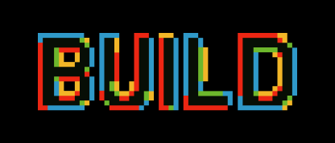

# Microsoft Build //localhost

## In‑Person Community Event Organizer Details

Microsoft Build //localhost is a global series of **community‑led, hands‑on, in‑person learning events** designed to extend Microsoft Build content directly into local technical communities.

Between **June 9–26, 2026**, community groups can host in‑person events with support from Microsoft.

---

## Event Overview

- **Date range:** June 9–26, 2026  
- **Format:** In‑person only  
- **Target audience:** Developers  
- **Minimum attendance:** 30 participants  

---

## Content Details

[View Build //localhost Content Catalog](https://aka.ms/MicrosoftBuild-localhosts-Content)

Microsoft Build repositories—including demos, presentation decks, and workshop materials—will be available beginning **June 2, 2026**.

To help you shape your event agenda, the catalog includes:
- **16 total sessions**
  - **4 hands‑on labs** (approximately 75 minutes each)
  - **12 breakout sessions** (45 minutes each)

This catalog is provided to support your planning efforts. Hosts are expected to submit a **copy of their final event agenda** as part of their post‑event recap through Microsoft’s vendor, **PlainSight**.

---

## Organizer Support by Community Type

### MVP‑Led User Groups

- Microsoft venue access (MVP‑only; subject to availability and local FTE support)
- Food & Beverage (F&B) and/or venue reimbursement up to **$500 USD**
- Hands‑on labs with **Azure credits**

### Azure Tech Group‑Led User Groups

- Food & Beverage (F&B) and/or venue reimbursement up to **$500 USD**
- Hands‑on labs with **Azure credits**

Azure Tech Group organizers may request up to **$500 USD total** in support, which can be applied flexibly toward either venue or F&B costs.

---

## Funding, Venue, and Reimbursement Guidelines

Food & Beverage (F&B) and/or venue support may be requested whether you are hosting at your own community location or utilizing a Microsoft venue. Availability is subject to current budget and may change.

Organizers are responsible for paying **all approved expenses up front** and will be reimbursed **after the event**. Please ensure you have received **prior approval** before making any purchases, as Microsoft will not reimburse expenses that were not approved in advance.

**Receipts are required for all reimbursement requests.**

---

## Reimbursement Process

Once your event support request is reviewed and approved through the survey—and the event is completed within the approved budget—**PlainSight**, a Microsoft vendor, will process reimbursement based on the documentation you provide.

You will receive a confirmation email containing:
- Your approved budget amount  
- A link to submit reimbursement documentation  

---

## Required Documentation

To avoid delays in processing by PlainSight, please submit the following:

- Receipts for approved expenses  
- Event report or summary  
- Event photos and/or evidence of attendance  

Please ensure all materials are **accurate and complete** prior to submission.

---

## Apply to Host

Once your in‑person event plan is ready, please submit the application:

[Apply to Host a Microsoft Build //localhost Event](https://aka.ms/MicrosoftBuild-localhost-application)

You can expect a follow‑up within **7 business days** after submission.

---

## Questions or Additional Information

For questions, contact the Azure Tech Groups team at  
**azure-tech-groups@microsoft.com**

For more details, see the  
[Frequently Asked Questions (FAQs)](https://github.com/microsoft/community-content/wiki/Microsoft-Build--localhost:-Frequently-Asked-Questions-(FAQs))

# Community Content Repo
### Prepared "content-in-a-box" from Microsoft for user groups, meetups, and events

- **WHAT**: This repo contains slides and supporting demos to help anyone in the community quickly deliver a talk around topics important to Microsoft. The content is prepared by Microsoft but is free for you to reuse and remix to deliver to local user groups, meetups, and community events. All content is licensed under Creative Commons Attribution 4.0 and all sample code is MIT.
- **WHY**: It takes time to develop new talks. 😅 Whether you're an experienced speaker or preparing to deliver your first talk, this content can help you get ready for your next speaking opportunity and expand the topics you're ready to cover as a speaker.
- **WHO**: You! 🎉 This content is for anyone that wants to deliver a talk.
- **WHEN**: Content in this repo will be updated quarterly. 📆 Check back often for new content-in-a-box resources. Old topics will be archived and new topics will be added so there's always something fresh to share with your community.
- **HOW**: Simply clone or fork this repo and practice the content. 🗣️ Most content-in-a-box sessions include slides, supporting sample code (which may be linked in an external repository), and additional guidance for delivering the talk (sometimes including a video of the session being delivered so you can see an example in action). Some slides may need updates (like your bio); others are ready to go. You can use everything as prepared, or if you have your own style or time constraints, you can remix to fit your situation. Content is designed to fit in a 30 to 45 minute session (leaving time for Q&A).

# Contributing

This project welcomes contributions and suggestions.  Most contributions require you to agree to a
Contributor License Agreement (CLA) declaring that you have the right to, and actually do, grant us
the rights to use your contribution. For details, visit https://cla.opensource.microsoft.com.

When you submit a pull request, a CLA bot will automatically determine whether you need to provide
a CLA and decorate the PR appropriately (e.g., status check, comment). Simply follow the instructions
provided by the bot. You will only need to do this once across all repos using our CLA.

This project has adopted the [Microsoft Open Source Code of Conduct](https://opensource.microsoft.com/codeofconduct/).
For more information see the [Code of Conduct FAQ](https://opensource.microsoft.com/codeofconduct/faq/) or
contact [opencode@microsoft.com](mailto:opencode@microsoft.com) with any additional questions or comments.

# Legal Notices

Microsoft and any contributors grant you a license to the Microsoft documentation and other content
in this repository under the [Creative Commons Attribution 4.0 International Public License](https://creativecommons.org/licenses/by/4.0/legalcode),
see the [LICENSE](LICENSE) file, and grant you a license to any code in the repository under the [MIT License](https://opensource.org/licenses/MIT), see the
[LICENSE-CODE](LICENSE-CODE) file.

Microsoft, Windows, Microsoft Azure and/or other Microsoft products and services referenced in the documentation
may be either trademarks or registered trademarks of Microsoft in the United States and/or other countries.
The licenses for this project do not grant you rights to use any Microsoft names, logos, or trademarks.
Microsoft's general trademark guidelines can be found at http://go.microsoft.com/fwlink/?LinkID=254653.

Privacy information can be found at https://privacy.microsoft.com

Microsoft and any contributors reserve all other rights, whether under their respective copyrights, patents,
or trademarks, whether by implication, estoppel or otherwise.

## Getting Help

If you get stuck or have any questions about building AI apps, join:

If you have product feedback or errors while building visit:

