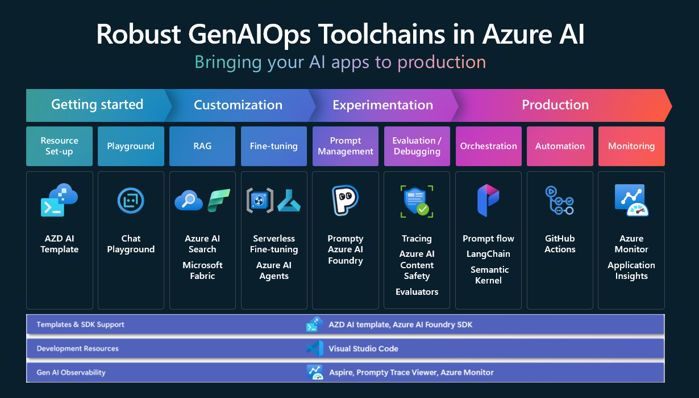

# Session Details

## Session Title: 
[Azure AI Foundry and the dev toolchain to infuse AI in all your apps](https://ignite.microsoft.com/sessions/BRK119)

## Session Abstract:
Unlock the power of GenAIOps and accelerate your AI apps from development to production with familiar tools. Learn to get started with AI templates, streamline prompt engineering with Prompty, build apps with SDKs like LangChain, and automate deployment using GitHub Actions. Plus, hear from a real customer who successfully implemented GenAIOps with Azure AI Foundry. Get ready to scale your AI projects effortlessly!

## Session level:
Advanced (300), technical

## Duration: 
1 hour

## Session Presentation, Video and Transcript
* [Presentation](https://medius.microsoft.com/video/asset/PPT/5d5904c5-5b71-4ee6-bb78-1d48987658fd?referrer=Microsoft+Ignite-%2Fen-US%2Fsessions%2FBRK119&mhid=ignite&loc=en-us)
* [Video](https://medius.microsoft.com/video/asset/HIGHMP4/5d5904c5-5b71-4ee6-bb78-1d48987658fd?referrer=Microsoft+Ignite-%2Fen-US%2Fsessions%2FBRK119&mhid=ignite&loc=en-us)
* [Transcript](https://medius.microsoft.com/video/asset/Transcript/5d5904c5-5b71-4ee6-bb78-1d48987658fd?referrer=Microsoft+Ignite-%2Fen-US%2Fsessions%2FBRK119&mhid=ignite&loc=en-us)
* [AZD AI Template for demo application: Creative Writing Assitant](https://azure.github.io/ai-app-templates/repo/azure-samples/contoso-creative-writer/)
* [GitHub repo for demo application: Creative Writing Assitant](https://github.com/Azure-Samples/contoso-creative-writer)

## Session Key technologies:
* [AI Toolkit for Visual Studio Code](https://learn.microsoft.com/windows/ai/toolkit/)
* [Prompty](https://prompty.ai/docs)
* [LangChain](https://python.langchain.com/docs/how_to/)
* [Azure Developer CLI](https://learn.microsoft.com/azure/developer/azure-developer-cli/install-azd?tabs=winget-windows%2Cbrew-mac%2Cscript-linux&pivots=os-windows) and [AI Templates](https://azure.github.io/ai-app-templates/)
* [Azure AI Foundry](https://learn.microsoft.com/azure/ai-studio/what-is-ai-studio) 
    * New [Tracing capabilities](https://learn.microsoft.com/azure/ai-studio/concepts/trace)
    * [Evaluation for text and image in the Azure AI Foundry SDK](https://learn.microsoft.com/azure/ai-studio/how-to/develop/evaluate-sdk)
* GitHub Actions

## Session Resources and references:
* [What is Gen AI Ops? Blog](https://techcommunity.microsoft.com/blog/aiplatformblog/the-future-of-ai-the-paradigm-shifts-in-generative-ai-operations/4254216)
* [AZD AI Template for demo application: Creative Writing Assitant](https://azure.github.io/ai-app-templates/repo/azure-samples/contoso-creative-writer/)
* [GitHub repo for demo application: Creative Writing Assitant](https://github.com/Azure-Samples/contoso-creative-writer)
